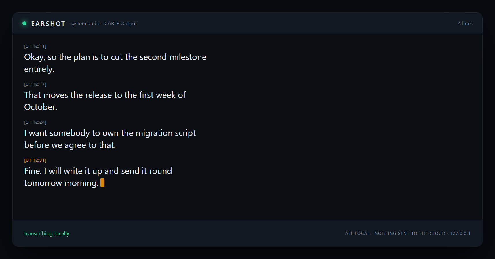

<h1 align="center">earshot</h1>

<p align="center">
  <strong>A live transcript of whatever your machine is hearing, produced entirely on your machine.</strong>
</p>

<p align="center">
  <a href="#license"></a>
  
  
  
  
</p>

<p align="center">
  
</p>

---

## The thing this is for

You are on a call, or listening to an interview, or watching a recording, and
you want the words. Every tool that does this well wants to upload your audio
first. Some of them want to join the meeting as a bot, with a name and a little
avatar, and announce to everyone in the room that a third party is now recording.

earshot does none of that. It listens to an audio device on your computer,
transcribes locally, and shows you the words as they arrive. There is no
account, no API key, no upload, and no network call anywhere in the pipeline
after the model weights are on disk. It is a listener, not a participant: it
never joins anything, never speaks, and never appears in anyone's meeting.

```
$ earshot --source system

01:12:04 [APP] listening to system audio (CABLE Output (VB-Audio Virtual Cable))
01:12:04 [APP] transcript: ./transcripts/2026-08-16_01-12-04.txt
01:12:04 [VIEW] live transcript at http://127.0.0.1:8377/

[01:12:11] So the plan is to cut the second milestone entirely.
[01:12:17] That moves the release to the first week of October.
[01:12:24] I want somebody to own the migration script before we agree to that.
```

## What it does

- **Captures audio** from a microphone, from system output (loopback), or from an
  existing recording.
- **Transcribes locally** with [faster-whisper](https://github.com/SYSTRAN/faster-whisper),
  running on CPU. A GPU helps and is not required.
- **Streams a live transcript** to a page on `127.0.0.1`, and to your terminal.
- **Saves the transcript** to a text file as it goes, with optional JSONL.

## What it deliberately does not do

No meeting automation, no bot that joins a call on your behalf, no summaries, no
speaker labels, no cloud fallback when the local model struggles, and no
telemetry. It captures audio and writes down words.

---

## Quickstart

**Prerequisites:** Node 20 or later, Python 3.9 to 3.12, and
[ffmpeg](https://ffmpeg.org/download.html) on your `PATH`.

```bash
git clone https://github.com/dimhold/earshot.git
cd earshot
npm install

# The transcription sidecar. CPU wheels only, no compiler needed.
python -m venv .venv
.venv/bin/python -m pip install -r python/requirements.txt      # macOS, Linux
# .venv\Scripts\python -m pip install -r python\requirements.txt  # Windows

# Fetch the speech model once (~150 MB for base.en) so the first
# session does not stall. This is the only step that uses the network.
npm run download-model

npm run build
node bin/earshot.mjs --open
```

`--open` launches the live view in your browser. Say something, and lines start
appearing. Ctrl+C finishes the utterance in progress and closes the file.

During development, skip the build and use `npm start -- --open`.

### The options you will actually use

```bash
earshot                                   # default microphone
earshot --source system                   # what your speakers are playing
earshot --source file --file talk.m4a     # an existing recording
earshot --list-devices                    # what ffmpeg can see

earshot --model small.en                  # more accurate, slower
earshot --language pl --model small       # a multilingual model
earshot --out notes.txt --jsonl           # where the transcript lands
earshot --no-view --quiet                 # just stdout, nothing else
earshot --threshold 250                   # a quieter room
```

`earshot --help` lists everything.

---

## The engine and the model

Transcription is [faster-whisper](https://github.com/SYSTRAN/faster-whisper), an
MIT licensed reimplementation of OpenAI's Whisper on top of CTranslate2. It was
picked over the alternatives for two boring reasons: it installs from prebuilt
CPU wheels, so contributors do not need a C++ toolchain, and it is fast enough
on a laptop CPU that a transcript keeps up with a conversation.

Models are downloaded from Hugging Face on first use and cached in `./models`,
inside the repository rather than in your home directory, so you always know
where the disk went and can delete it in one move.

| model | size on disk | roughly |
|---|---|---|
| `tiny.en` | 75 MB | fast, and wrong often enough to notice |
| `base.en` | 145 MB | the default, fine for a clear speaker |
| `small.en` | 480 MB | where most people stop complaining |
| `medium.en` | 1.5 GB | good, and slow on CPU |
| `large-v3` | 3.1 GB | multilingual, wants a GPU |

The `.en` models are English only. For anything else, drop the suffix and set
the language: `--model small --language pl`. With a GPU, add
`--stt-device cuda --compute-type float16`.

```bash
EARSHOT_MODEL=small.en npm run download-model
earshot --model small.en
```

---

## Audio capture, honestly

Microphone capture works everywhere. System audio does not, and no amount of
code in this repository can change that.

| | microphone | system audio (loopback) |
|---|---|---|
| **Linux** (PulseAudio or PipeWire) | works out of the box | works out of the box, via `@DEFAULT_MONITOR@` |
| **Windows** 10 and 11 | works out of the box | needs Stereo Mix or [VB-CABLE](https://vb-audio.com/Cable/) |
| **macOS** 12 and later | works, after granting microphone permission | needs [BlackHole](https://github.com/ExistentialAudio/BlackHole) or similar |

PulseAudio exposes a `.monitor` source for every output, so Linux gets loopback
for free. Windows has WASAPI loopback but ffmpeg's DirectShow input cannot reach
it, and macOS gives an ordinary process no system audio capture API at all. Both
need a virtual output device, which is a five minute install and then never
thought about again.

When earshot cannot find a loopback device it stops with an error instead of
falling back to the microphone, because a transcript of the wrong audio source
is worse than no transcript.

Full setup notes, including the macOS permission prompt that fails silently and
what to do when the transcript comes out empty, are in
**[docs/audio-capture.md](docs/audio-capture.md)**.

---

## How it works

```
  ffmpeg                Node                        Python
 ┌────────────┐   16 kHz mono PCM   ┌────────────┐  utterance  ┌──────────────┐
 │ dshow      │ ──────────────────► │ Segmenter  │ ──────────► │ faster-      │
 │ avfound.   │                     │ (energy    │             │ whisper      │
 │ pulse      │                     │  VAD)      │ ◄────────── │ (CTranslate2)│
 └────────────┘                     └─────┬──────┘    text     └──────────────┘
                                          │
                          ┌───────────────┼───────────────┐
                          ▼               ▼               ▼
                    transcript.txt    stdout      127.0.0.1:8377
```

Whisper transcribes a clip, not a stream, so something has to decide where one
clip ends and the next begins. An energy threshold with a 700 ms silence
hangover does that, and two details matter more than the threshold itself:

- A **rolling pre-roll buffer** keeps the 300 ms before onset. The detector
  always notices a word slightly after it started, and without the pre-roll
  every line loses its first syllable.
- A **hard cap** flushes an utterance at 15 seconds, because somebody who talks
  for two minutes without pausing should not wait two minutes for a line.

Utterances go to the model as soon as they close, so a slow transcription never
stalls capture, but results are applied through a promise chain so lines cannot
land out of order. A long clip takes longer than a short one, and a transcript
with sentences swapped is worse than one that is a second late.

One more thing that only shows up in practice: handed near-silence, Whisper
reliably produces stock phrases from its training data, mostly "Thank you." and
"Thanks for watching!". earshot drops those when the clip contained almost no
voiced audio, and keeps them when somebody actually said the words.

### Layout

| path | what lives there |
|---|---|
| `src/audio/` | ffmpeg argument building, device discovery, the capture process |
| `src/stt/` | the segmenter, and the faster-whisper sidecar client |
| `src/transcript/` | line assembly, filtering, file writing |
| `src/view/` | the loopback HTTP server and the live page |
| `src/core/` | config, pipeline wiring, the app |
| `python/stt_server.py` | the transcription sidecar |

---

## Privacy

The whole point, stated plainly:

- **No audio leaves the machine.** Capture, segmentation and transcription all
  happen locally. The model runs in a process on your computer.
- **No network calls at runtime.** The only download is the model, once, through
  `npm run download-model`. After that you can run earshot with the network off,
  and it is worth doing so at least once to confirm.
- **No account, no key, no telemetry.** There is nothing to sign into.
- **The live view is loopback only.** It binds to `127.0.0.1` and rejects any
  request whose `Host` header is not loopback, so a page in another tab cannot
  rebind DNS and read your transcript. The page loads no font, script or image
  from anywhere.
- **Transcripts stay where you put them.** `transcripts/` is in `.gitignore`.

What earshot cannot do is tell the other people in the room that you are
recording them. That is on you, and in several jurisdictions it is also the law.

---

## Development

```bash
npm test            # unit and pipeline tests, no audio device needed
npm run typecheck
npm run build
npm run make-fixture   # regenerate the synthetic test audio
```

The tests cover the segmenter (boundaries, pre-roll, the too-short click, chunk
size independence), config parsing, transcript assembly and filtering, the file
writer, the ffmpeg argument builders and device list parsers for all three
platforms, and the loopback server. The pipeline test drives capture, segmenting,
recognition and line ordering end to end from a synthetic fixture file with a
fake recogniser, so it runs in a second and needs no model.

**Tested by hand, not by CI:** live capture from real devices on each platform,
the loopback setups, GPU inference, and transcription accuracy. Those need
hardware, drivers and a person listening, and pretending otherwise with a
green checkmark would be worse than saying so.

## Limitations

- Utterance based, not word by word. A line appears after the speaker pauses,
  which is typically half a second to two seconds behind the room.
- No speaker labels. Everything is one stream of text.
- Accuracy is whatever the Whisper model you chose gives you, and that drops
  with crosstalk, accents and bad microphones.
- Windows and macOS need a virtual audio device for system capture, as above.

## Prior work

Checked 2026-08-27. This niche closed during 2025.

- [whisper.cpp](https://github.com/ggerganov/whisper.cpp) is the reference local
  implementation.
- [Handy](https://github.com/cjpais/Handy) grew to roughly 30k stars in 18
  months on the same pitch: local transcription, nothing uploaded.
- Apple shipped on device transcription in the OS.

This tool stays useful to its author and to anyone who wants a plain Node
pipeline with a live view and no network calls. It is not a new category.

## License

MIT. See [LICENSE](LICENSE).

faster-whisper is MIT licensed, CTranslate2 is MIT licensed, and the Whisper
model weights are released by OpenAI under MIT. ffmpeg is a separate program
that earshot runs rather than bundles, under whichever license your build of it
carries.
